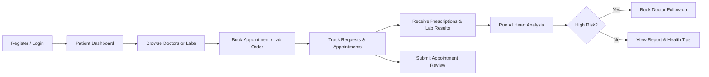

# TABEEBAK Frontend

[](https://react.dev/)
[](https://www.typescriptlang.org/)
[](https://vitejs.dev/)
[](https://tailwindcss.com/)
[](LICENSE)

**TABEEBAK** is the frontend web application for the TABEEBAK Healthcare Management Platform — a unified digital health ecosystem that connects **Patients**, **Doctors**, **Laboratories**, and **Administrators** in a single platform.

The application enables appointment booking, prescription management, laboratory workflows, account settings, notifications, and **AI-powered heart disease risk prediction** based on cardiac lab measurements.

---

## Table of Contents

- [Project Overview](#project-overview)
- [Features](#features)
- [Technology Stack](#technology-stack)
- [Project Structure](#project-structure)
- [Installation](#installation)
- [Environment Variables](#environment-variables)
- [Available Scripts](#available-scripts)
- [User Roles](#user-roles)
- [Main Workflows](#main-workflows)
- [API Integration](#api-integration)
- [AI Integration](#ai-integration)
- [Screenshots](#screenshots)
- [Future Enhancements](#future-enhancements)
- [Contributors](#contributors)

---

## Project Overview

TABEEBAK is a full-stack healthcare management platform designed to streamline interactions between patients and healthcare providers. The frontend delivers role-based portals, public marketing pages, and responsive dashboards for day-to-day clinical and operational workflows.

| Stakeholder | Frontend Access |
|---|---|
| **Patients** | Book doctors, manage appointments, view prescriptions and lab results, run AI health analysis |
| **Doctors** | Manage requests, appointments, prescriptions, patient records, schedule, and reviews |
| **Laboratories** | Process lab orders, upload results, manage schedule and profile |
| **Administrators** | Platform governance (provider onboarding is admin-managed; see [User Roles](#user-roles)) |

A distinguishing capability is the integration of **machine-learning heart disease prediction**. When eligible lab results are available, patients can trigger AI analysis that evaluates cardiac risk indicators and surfaces actionable follow-up guidance.

---

## Features

### Authentication & Authorization

- Patient self-registration, login, forgot password, and reset password flows
- JWT-based session management with `localStorage` persistence
- Role-based route protection via `ProtectedRoute`
- Auth bootstrap that validates stored tokens against `/api/v1/me`
- Doctor and Laboratory accounts are provisioned by administrators (not self-registered)

### Patient Portal

- Dashboard with health summary, upcoming appointments, prescriptions, and lab results
- Doctor and laboratory discovery with booking workflows
- Appointment management (view, reschedule, cancel, review)
- Prescription and lab result access
- Health tips, profile/medical/insurance settings, and help center
- AI heart disease risk analysis on completed lab results

### Doctor Portal

- Dashboard with today's appointments, pending requests, and review metrics
- Appointment request inbox with approval workflow
- Appointment lifecycle management and prescription creation
- Patient directory and patient summary views
- Schedule and availability management
- Review analytics and patient feedback

### Laboratory Portal

- Dashboard with order volume, pending/completed test metrics, and ratings
- Request inbox with approve/reject workflow
- Pending and completed order queues
- Order details, result submission, and timeline tracking
- Schedule and laboratory profile/settings management

### Admin Portal

> **Note:** The `Admin` role is defined in the authentication model, and admin-driven provider onboarding is referenced throughout the app (registration, login, and contact flows). A dedicated Admin dashboard UI is **not yet implemented** in this frontend repository. Administrative operations are currently handled through backend processes and the public contact/onboarding form.

### Appointment Management

- Patient booking with available time-slot selection
- Appointment status tracking with timeline components
- Reschedule and cancel dialogs
- Doctor-side request approval and appointment detail views

### Prescription Management

- Doctor prescription creation linked to appointments
- Prescription listing and detail views for doctors and patients
- Refill and medication metadata display

### Lab Result Management

- Patient lab order and result browsing
- Laboratory order processing and result upload
- Measurement normalization with cardiac schema support
- Status badges and workflow timelines

### Notifications

- In-app notification center with pagination, search, and type filters
- Mark individual or all notifications as read
- Notification preference management in account settings
- Deep-linking for review-related notification actions

### Review & Rating System

- Post-appointment patient reviews (create/update)
- Star rating display on doctor directory and profiles
- Doctor review summary and paginated feedback inbox
- Laboratory rating display on dashboard

### AI Analysis Integration

- Heart disease prediction triggered from patient lab result details
- Risk level, probability, threshold, and explanation display
- High-risk redirect to doctor booking flow
- Downloadable AI health risk report (print-friendly HTML)

### Responsive UI

- Mobile-aware layouts with Tailwind CSS breakpoints
- Dark/light theme support via `next-themes`
- shadcn/ui component library built on Radix UI primitives
- Accessible forms with React Hook Form and Zod validation

---

## Technology Stack

| Category | Technology |
|---|---|
| **Core** | [React 18](https://react.dev/), [TypeScript 5.8](https://www.typescriptlang.org/) |
| **Build Tool** | [Vite 5](https://vitejs.dev/) with `@vitejs/plugin-react-swc` |
| **Routing** | [React Router DOM 6](https://reactrouter.com/) |
| **State & Data Fetching** | [TanStack React Query 5](https://tanstack.com/query) |
| **HTTP Client** | [Axios 1.x](https://axios-http.com/) |
| **Styling** | [Tailwind CSS 3.4](https://tailwindcss.com/), [tailwindcss-animate](https://github.com/jamiebuilds/tailwindcss-animate) |
| **UI Components** | [shadcn/ui](https://ui.shadcn.com/) (Radix UI primitives) |
| **Forms & Validation** | [React Hook Form](https://react-hook-form.com/), [Zod](https://zod.dev/), `@hookform/resolvers` |
| **Charts** | [Recharts 2](https://recharts.org/) |
| **Icons** | [Lucide React](https://lucide.dev/) |
| **Typography** | [Plus Jakarta Sans](https://fonts.google.com/specimen/Plus+Jakarta+Sans) via `@fontsource/plus-jakarta-sans` |
| **Date Utilities** | [date-fns 3](https://date-fns.org/), `react-day-picker` |
| **Notifications (Toast)** | [Sonner](https://sonner.emilkowal.ski/), Radix Toast |
| **Theming** | [next-themes](https://github.com/pacocoursey/next-themes) |
| **Linting** | ESLint 9 with TypeScript ESLint |

> **Not used in this project:** Redux Toolkit, Material UI. Server state is managed with TanStack React Query; UI is built with Tailwind CSS and shadcn/ui.

---

## Project Structure

```
Tabeebak/
├── public/                     # Static assets served as-is
├── src/
│   ├── assets/                 # Images and static media (e.g., logo)
│   ├── components/
│   │   ├── appointments/       # Reschedule, cancel appointment dialogs
│   │   ├── auth/               # Auth layout and protected route guard
│   │   ├── booking/            # Time slot picker for appointments
│   │   ├── dashboard/          # Shared dashboard shell/layout
│   │   ├── doctor/             # Doctor-specific timeline components
│   │   ├── doctors/            # Public/patient doctor directory
│   │   ├── error/              # Global error boundary
│   │   ├── home/               # Landing page sections (hero, services, heart health)
│   │   ├── lab/                # Laboratory cards, test categories, timelines
│   │   ├── layout/             # Navbar, footer
│   │   ├── patient/            # Patient booking flow and navigation helpers
│   │   ├── reviews/            # Star ratings, review modal, review display
│   │   ├── settings/           # Account, profile, notification settings
│   │   ├── shared/             # Reusable cross-role components
│   │   └── ui/                 # shadcn/ui primitive components
│   ├── hooks/                  # Custom React hooks (auth, profiles, workflows)
│   ├── lib/                    # Utilities, status mappers, AI measurement schema
│   ├── pages/
│   │   ├── doctor/             # Doctor portal pages
│   │   ├── lab/                # Laboratory portal pages
│   │   ├── patient/            # Patient portal pages
│   │   └── *.tsx               # Public pages (Index, Login, Register, etc.)
│   ├── services/               # API service layer (Axios wrappers per domain)
│   ├── types/                  # TypeScript interfaces and API response types
│   ├── App.tsx                 # Root router and provider composition
│   ├── main.tsx                # Application entry point
│   └── index.css               # Global styles and CSS variables
├── components.json             # shadcn/ui configuration
├── index.html                  # HTML shell
├── package.json
├── tailwind.config.ts
├── tsconfig.json
└── vite.config.ts
```

### Folder Purposes

| Folder | Purpose |
|---|---|
| `src/pages/` | Route-level page components organized by role (`patient/`, `doctor/`, `lab/`) and public marketing/auth pages |
| `src/components/` | Reusable UI and feature components grouped by domain |
| `src/services/` | Axios-based API clients encapsulating backend endpoints |
| `src/hooks/` | React Query hooks and auth context for data fetching and mutations |
| `src/types/` | Shared TypeScript contracts for API payloads and domain models |
| `src/lib/` | Pure helpers — date formatting, status labels, heart measurement schema, auth routing |

---

## Installation

### Prerequisites

- **Node.js** 18+ (LTS recommended)
- **npm** 9+ (or compatible package manager)
- Running **TABEEBAK backend API** (default: `http://localhost:5000`)

### 1. Clone the Repository

```bash
git clone <repository-url>
cd Tabeebak
```

### 2. Install Dependencies

```bash
npm install
```

### 3. Configure Environment Variables

Create a `.env` file in the project root (see [Environment Variables](#environment-variables)):

```env
VITE_API_BASE_URL=http://localhost:5000
```

### 4. Run the Development Server

```bash
npm run dev
```

The app will be available at **http://localhost:8080** (configured in `vite.config.ts`).

### 5. Build for Production

```bash
npm run build
```

Output is written to the `dist/` directory. Preview the production build locally:

```bash
npm run preview
```

---

## Environment Variables

Vite exposes only variables prefixed with `VITE_` to client-side code.

| Variable | Required | Default | Description |
|---|---|---|---|
| `VITE_API_BASE_URL` | No | `http://localhost:5000` | Base URL for all backend API requests. Set this when the API runs on a different host, port, or deployment URL (e.g., ngrok, staging, production). |

### Example `.env` File

```env
# Backend API base URL
VITE_API_BASE_URL=http://localhost:5000
```

### Built-in Vite Variables (no configuration needed)

| Variable | Description |
|---|---|
| `import.meta.env.DEV` | `true` in development; enables debug logging in auth and API layers |
| `import.meta.env.PROD` | `true` in production builds |
| `import.meta.env.MODE` | Current Vite mode (`development`, `production`, etc.) |

---

## Available Scripts

| Script | Command | Description |
|---|---|---|
| `dev` | `npm run dev` | Starts the Vite development server on port **8080** with hot module replacement |
| `build` | `npm run build` | Creates an optimized production build in `dist/` |
| `build:dev` | `npm run build:dev` | Builds the app in Vite `development` mode (useful for debugging production bundles) |
| `preview` | `npm run preview` | Serves the production build locally for verification |
| `lint` | `npm run lint` | Runs ESLint across the project |

---

## User Roles

The platform supports four user roles defined in `src/types/auth.types.ts`:

### Patient

- Self-registers through `/register`
- Accesses `/patient/*` routes after authentication
- Books appointments, views medical records, manages prescriptions and lab results, and runs AI analysis

### Doctor

- Account created by an administrator
- Accesses `/doctor/*` routes
- Manages appointment requests, clinical visits, prescriptions, patient summaries, schedule, and reviews

### Laboratory

- Account created by an administrator
- Accesses `/lab/*` routes
- Processes lab orders, submits results, manages operational schedule and laboratory profile

### Admin

- Platform administrator role recognized by the auth model
- Responsible for provisioning Doctor and Laboratory accounts
- Provider onboarding requests are submitted via the public **Contact** page (`/contact`)
- **Current frontend scope:** No dedicated `/admin/*` dashboard routes are implemented in this repository

---

## Main Workflows

### Patient Journey



1. Register or sign in as a Patient
2. Explore doctors (`/patient/doctors`) or laboratories (`/patient/labs`)
3. Submit booking requests and track them in **Requests** and **Appointments**
4. View prescriptions and lab results when available
5. Run AI heart disease prediction on eligible lab results
6. If high risk is detected, navigate to doctor booking with contextual redirect
7. Submit post-visit reviews and manage notification preferences

### Doctor Workflow

1. Sign in with an admin-provisioned Doctor account
2. Review pending appointment requests in the inbox (`/doctor/requests`)
3. Approve or manage appointments (`/doctor/appointments`)
4. Create prescriptions from appointment details
5. Browse patient records and medical summaries
6. Configure availability in **Schedule** and professional profile in **Settings**
7. Monitor patient reviews and ratings

### Laboratory Workflow

1. Sign in with an admin-provisioned Laboratory account
2. Monitor dashboard metrics (pending tests, completions, ratings)
3. Review incoming orders in the request inbox (`/lab/requests`)
4. Approve or reject orders; process active work in **Pending**
5. Submit lab results and mark orders **Completed**
6. Manage laboratory schedule, branches, services, and profile settings

### Admin Workflow

> Admin workflows are primarily backend-driven in the current frontend release.

1. Receive Doctor/Laboratory onboarding requests via the Contact form
2. Provision provider accounts on the backend
3. Providers sign in and access their respective portals
4. *(Planned)* Dedicated admin dashboard for user management, analytics, and platform configuration

---

## API Integration

The frontend communicates with the TABEEBAK backend through a centralized Axios client in `src/services/api.ts`.

### Architecture

```
Page / Component
      ↓
Custom Hook (TanStack React Query)
      ↓
Service Module (auth, patient, doctor, lab, me, …)
      ↓
apiRequest() → Axios Client (baseURL + interceptors)
      ↓
TABEEBAK Backend API
```

### Base Configuration

- **Base URL:** `VITE_API_BASE_URL` or `http://localhost:5000`
- **Timeout:** 15 seconds
- **Content-Type:** `application/json` (auto-removed for `FormData` uploads)
- **Path alias:** `@/` maps to `src/` (configured in `vite.config.ts`)

### Authentication Flow

1. **Login/Register** — `POST /auth/signin` or `POST /auth/register` returns a JWT `token`
2. **Session Storage** — Token and user profile are stored in `localStorage` under the key `tabeebak_auth`
3. **Bootstrap** — On app load, if a token exists, `GET /api/v1/me` validates the session and loads the current user
4. **Authenticated Requests** — Service calls pass `{ auth: true }` to attach `Authorization: Bearer <token>`
5. **Logout** — Clears `localStorage`, resets React Query caches, and redirects to login
6. **Route Guard** — `ProtectedRoute` enforces authentication and role-based access

### Service Modules

| Service | Responsibility |
|---|---|
| `auth.service.ts` | Register, sign-in, password reset, session persistence |
| `me.service.ts` | Current user profile, notifications, security, preferences |
| `patient.service.ts` | Patient dashboard, appointments, prescriptions, lab results, AI prediction |
| `patient-booking.service.ts` | Doctor/lab discovery and booking |
| `doctor-workflow.service.ts` | Doctor appointments, requests, prescriptions, patients |
| `doctor-profile.service.ts` | Doctor profile, schedule, availability |
| `lab-workflow.service.ts` | Lab orders, result submission, request handling |
| `lab-profile.service.ts` | Laboratory profile and dashboard summary |
| `doctors.service.ts` | Public doctor directory |
| `contact.service.ts` | Provider onboarding contact form |

### Error Handling

API errors are normalized into an `ApiError` class with `error`, `message`, and `statusCode` fields. Network failures surface as `NETWORK_ERROR`. Development mode enables structured console logging for requests, responses, and auth events.

---

## AI Integration

TABEEBAK integrates **heart disease risk prediction** into the patient lab results workflow.

### How It Works

1. **Eligible Results** — When a lab result reaches a visible/completed workflow status, AI analysis becomes available on the Lab Result Details page (`/patient/lab-results/:resultId`).

2. **Measurement Mapping** — Lab measurements are mapped to a cardiac schema (`src/lib/heartMeasurementSchema.ts`) including indicators such as chest pain type (`cp`), resting blood pressure (`trestbps`), cholesterol (`chol`), fasting blood sugar (`fbs`), resting ECG (`restecg`), max heart rate (`thalach`), and related clinical fields.

3. **Run Prediction** — The patient triggers analysis, which:
   - Validates profile data (age from date of birth, gender)
   - Structures measurement values into the prediction payload
   - Calls `POST /api/v1/patients/me/lab-results/:resultId/predict`

4. **Fetch Results** — Existing predictions are loaded via:
   - `GET /api/v1/patients/me/lab-results/:resultId/predictions`

5. **Display to Patient** — The UI presents:
   - **Risk Level** — Low or High
   - **Probability** — Model confidence score
   - **Threshold Used** — Decision threshold applied
   - **Explanation** — Human-readable AI summary
   - Measurement table with reference ranges and status indicators

6. **High-Risk Follow-up** — If risk is **High**, the patient is prompted to book a doctor consultation. Navigating to `/patient/doctors` carries `source: "ai_prediction"` state for contextual messaging.

7. **Report Export** — Patients can generate a printable **AI Health Risk Report** combining test details, measurements, and analysis results.

### Landing Page Awareness

The public homepage (`/`) includes a **Heart Disease** educational section (`HeartDiseaseSection`) with prevention guidance and a call-to-action to find a heart specialist.

> **Disclaimer:** AI-generated analysis is informational only and does not replace professional medical advice.

---

## Screenshots

> Add screenshots to a `docs/screenshots/` directory and update the paths below.

| Screen | Preview |
|---|---|
| Landing Page | `` |
| Patient Dashboard | `` |
| Doctor Appointments | `` |
| Laboratory Orders | `` |
| Lab Result AI Analysis | `` |
| Appointment Booking | `` |

---

## Future Enhancements

The following capabilities are planned for future releases:

| Enhancement | Description |
|---|---|
| **IoT Wearable Synchronization** | Sync vitals from wearable devices into patient health profiles |
| **Apple HealthKit Integration** | Import health metrics from iOS devices |
| **Google Health Connect Integration** | Import health data from Android ecosystem |
| **Online Payment Integration** | In-app payment for appointments and lab services |
| **Telehealth Services** | Virtual consultations and video visit scheduling |
| **Admin Dashboard** | Dedicated frontend portal for user management and platform administration |

---

## Contributors

We welcome contributions from developers, designers, and healthcare domain experts.

### How to Contribute

1. Fork the repository
2. Create a feature branch (`git checkout -b feature/your-feature`)
3. Commit your changes (`git commit -m "Add your feature"`)
4. Push to the branch (`git push origin feature/your-feature`)
5. Open a Pull Request

### Contributors

| Name | Role | GitHub |
|---|---|---|
| _Your Name_ | _Project Lead / Frontend Developer_ | [@username](https://github.com/username) |
| _Team Member_ | _Backend Developer_ | [@username](https://github.com/username) |
| _Team Member_ | _UI/UX Designer_ | [@username](https://github.com/username) |
| _Team Member_ | _QA / Testing_ | [@username](https://github.com/username) |

> Replace the placeholder rows above with actual team member names, roles, and GitHub profiles.

---

## Related Resources

| Resource | Location |
|---|---|
| Backend API | Configure via `VITE_API_BASE_URL` |
| Dev Server | `http://localhost:8080` |
| Default API | `http://localhost:5000` |
| Path Alias | `@/` → `src/` |

---

<p align="center">
  <strong>TABEEBAK</strong> — Your Trusted Healthcare Partner<br/>
  <em>Built for graduation projects, portfolios, and production-ready healthcare platforms.</em>
</p>
